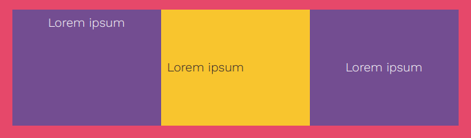

Some items are automatically centred because of the style for their element. 

You can use the `xcenter` and `ycenter` classes to centre other elements horizontally and vertically. 

--- code ---
---
language: html
filename: index.html
line_numbers: false
---

<section class="wrap">
  

    
Lorem ipsum

  

  

    
Lorem ipsum

  

  

     
Lorem ipsum

  

</section>

--- /code ---
