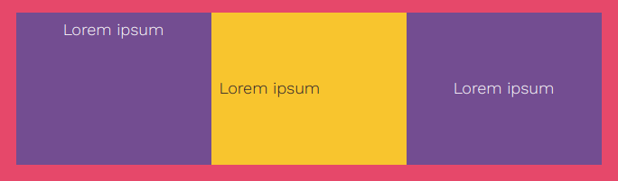

某些项目由于其元素的样式而自动居中。

你可以使用 `xcenter` 和 `ycenter` 类将其他元素水平和垂直居中。

--- code ---
---
language: html
filename: index.html
line_numbers: false
---

<section class="wrap">
  

    
Lorem ipsum

  

  

    
Lorem ipsum

  

  

     
Lorem ipsum

  

</section>

--- /code ---
